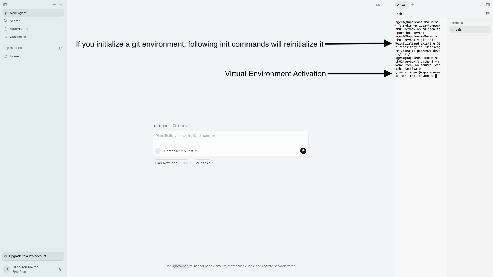
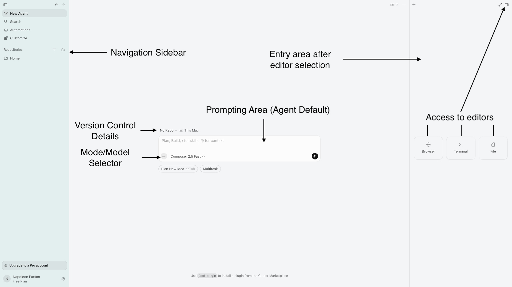
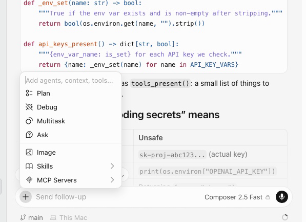
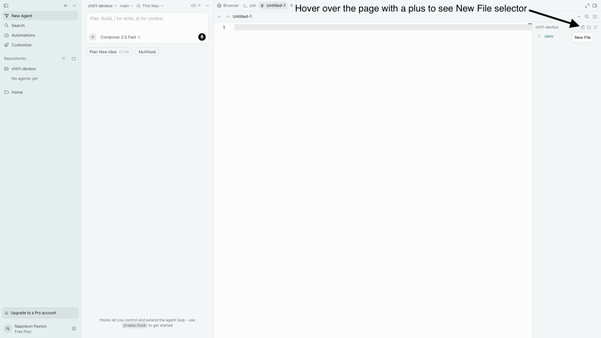
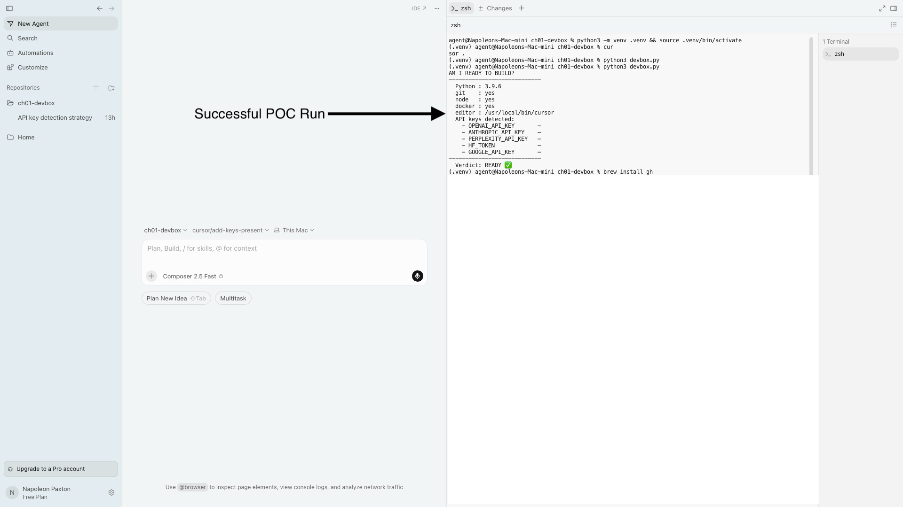
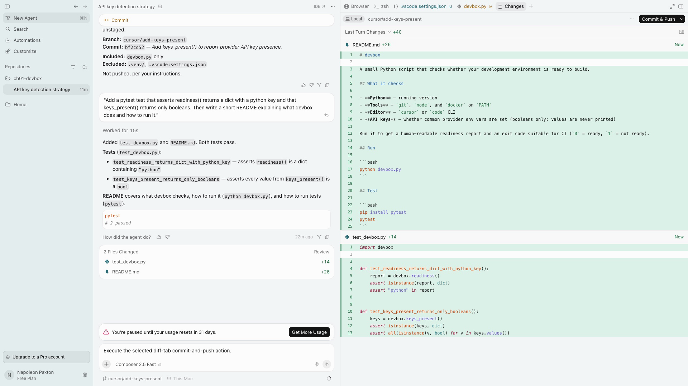
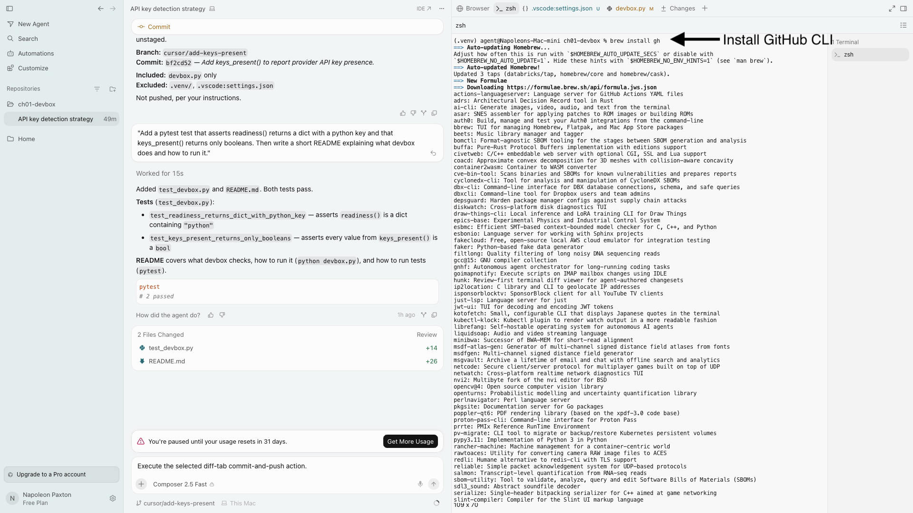
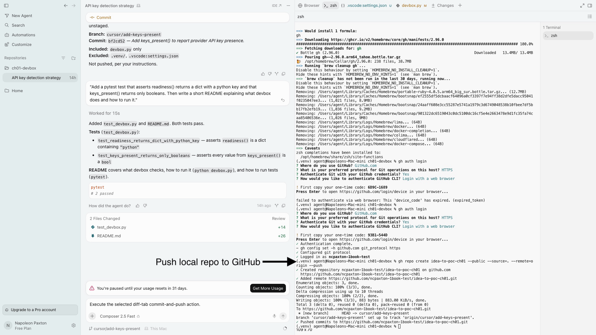
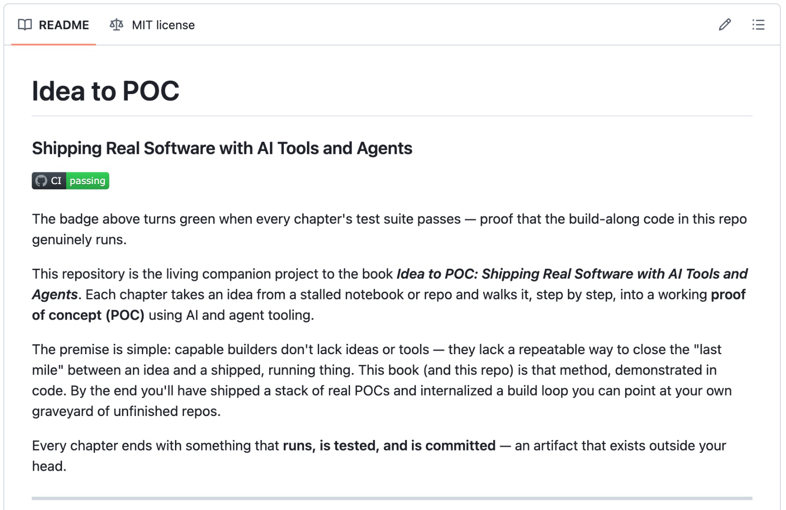

# Appendix E — Chapter 1 Figure Index

Chapter 1 is heavy on screenshots, because setting up an environment is the one place where *seeing* the exact button, prompt, or message saves you ten minutes of doubt. This appendix reproduces all nine figures inline, in the order they appear in the chapter, each with a short note on where it belongs and what to look for.

**Why this page exists.** Print it, or keep it open on a second screen, and you can work through Chapter 1 start to finish without switching to the repo to check a single screenshot at a time. Every figure is right here on one page.

The source images live in the public repo under [`images/ch01/`](https://github.com/lion-of-naples/idea-to-poc/tree/main/images/ch01).

---

## Figure 1 — Activated virtual environment

*Step 3.2, right after you activate the `.venv`.* Your terminal prompt now begins with `(.venv)` — the sign that the virtual environment is active and anything you install lands in this project, not your system Python.

---

## Figure 2 — The Cursor window, labeled

*Step 3.2, "Get your bearings," when you first open the project folder.* The five regions you'll use all chapter: the left rail (New Agent, Search, Repositories), the file panel on the right, the center editor with its Browser/terminal/file tabs, and the agent/chat panel just left of the editor.

---

## Figure 3 — The expanded Composer mode menu

*Step 3.2, immediately after the labeled window.* The mode selector reads **Composer 2.5 Fast**; the open menu above it lists the alternate modes (Plan, Debug, Multitask, and the read-only Ask) plus context/tool attachments (Image, Skills, MCP Servers). Composer *is* the agent — there is no item named "Agent."

---

## Figure 4 — Creating a new file

*Step 3.2, "Where the code goes."* The **New File** action on the right-hand file panel — hover the `ch01-devbox` project header and the button appears at its top-right. This is how you create every file in the chapter (not the terminal, not the chat box).

---

## Figure 5 — The readiness report

*Step 3.4, after you run `python3 devbox.py`.* The `AM I READY TO BUILD?` report ending in `READY ✅` (or a `NOT READY ❌` line if something's missing). This is your first working tool's output.

---

## Figure 6 — The "out of usage" message

*Step 3.5, on the sidebar when your monthly AI allowance is spent.* The "paused until usage resets" banner. Seeing this mid-chapter costs you nothing — you've already shipped the result — so just pick one of the three options in the text and keep going.

---

## Figure 7 — Installing the GitHub CLI

*Step 3.7, when you install `gh`.* `brew install gh` running in the terminal (macOS). Windows and Linux equivalents are in the text.

---

## Figure 8 — Authenticating and pushing to GitHub

*Step 3.7, Option A (the `gh` route).* The one-time device code appears **right in the terminal** (the `! First copy your one-time code:` line), followed by `gh repo create --source=. --push`. Note: this screenshot uses a throwaway `idea-to-poc-ch01` repo the author made *after* finishing the book, to walk the step exactly as you will — so the account and repo names won't match this repo. Yours will use your own username.

---

## Figure 9 — CI passing (green)

*Step 3.7, after the push, once your workflow runs.* A green check on your repo's Actions tab and a **passing** CI badge on your README — your proof the project works on a clean machine, not just yours.

---

*As later chapters add their own screenshots, this index will grow to cover them too. For now it maps Chapter 1 end to end.*
